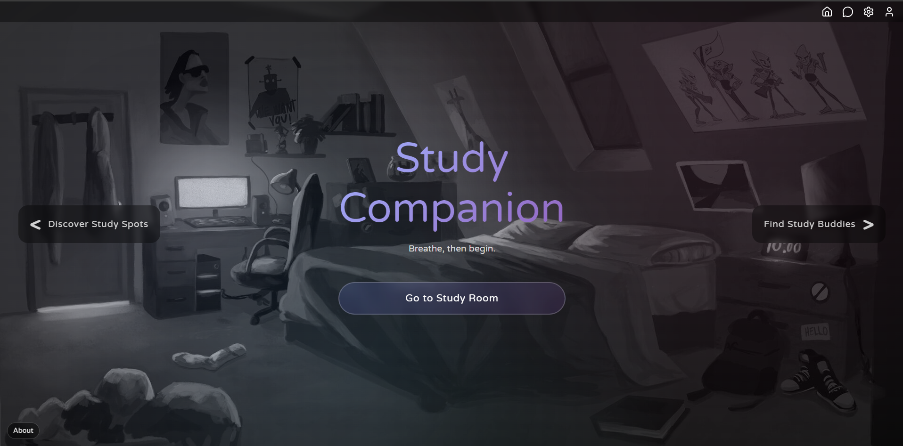

# Study Companion

> A hackathon prototype that helps students focus and find the right people to study with.

**Live site:** https://adammirmina.github.io/HelloWorldHackathon/
**Hackathon:** Purdue Hello World — **Sep 20–21, 2025**
**Team:** Adam Mirmina, Bonnie Le, Kyler Yun

---

## What it is

Study Companion blends a focused **lofi study room**, lightweight **profiles**, and class-based **study buddy matching**.

- **Study Room** – distraction-light page with lofi music and a simple timer
- **Find Study Buddies** – match by **school, classes, and preferences**
- **Profiles** – public/private visibility, optional contact info
- **Matching Score** – each candidate gets a **1–5 score** based on multiple signals:
  - Shared classes (highest weight; multiple overlaps boost the score)
  - Study style alignment (e.g., quiet vs. collaborative)
  - Time preference (morning / afternoon / evening)

> ⚠️ **Prototype status:**
> **Private Messaging** is demo-only (local, non-realtime, no cross-device sync).
> **Study Spots** is a proof-of-concept UI (not backed by live data yet).

---

## Project structure

```text
HelloWorldHackathon/
└─ docs/                      # GitHub Pages root (site lives here)
   ├─ index.html              # Home
   ├─ about.html
   ├─ profile.html
   ├─ settings.html
   ├─ signin.html
   ├─ src/
   │  ├─ messages.html
   │  ├─ buddy.html
   │  ├─ lofi.html
   │  ├─ spots.html
   │  ├─ config/
   │  │  └─ firebase.js      # Your Firebase config
   │  └─ module/
   │     ├─ auth.js
   │     ├─ nav.js
   │     ├─ match.js
   │     ├─ messages.js
   │     ├─ profile.js
   │     └─ (other modules)
   ├─ audio/                  # lofi audio
   └─ wallpapers/             # background media
```

---

## Deployment (GitHub Pages)

This repo is already set up to deploy from **main → docs/**.
Push to main, then check your site at:
https://<your-username>.github.io/HelloWorldHackathon/

---

## Scalability & Next Steps

- **Study Spots: real-time campus signals**
  Integrate Purdue **UniTime** scheduling and **ID swipe aggregates** to infer building/space crowd levels in real time (privacy-preserving, anonymized).

- **AI spot recommendations**
  Rank and recommend study locations based on user preferences (noise tolerance, outlets, group size, caffeine proximity), combining live crowd data with historical trends.

- **Fully live messaging**
  Replace the demo with a realtime backend (e.g., Firebase/Firestore + WebSockets), typing indicators, read receipts, push notifications, and message retention policies.

- **Multi-campus expansion**
  Generalize the schema for multiple universities, add school-based discovery, and collaborate with student groups to seed initial data and moderation.

- **Live study rooms (video)**
  WebRTC-based focus rooms with optional camera/mic, synchronized Pomodoro timers, and presence indicators.

- **More music options**
  More curated lofi playlists, basic controls, and the ability to add ambient sounds.

---

## Privacy

Profiles can be public or private. Demo messages are stored only in your browser’s **localStorage** and are not transmitted to a server. Please don’t share sensitive information in the demo.

---

## License

MIT
© 2025 Study Companion Team
